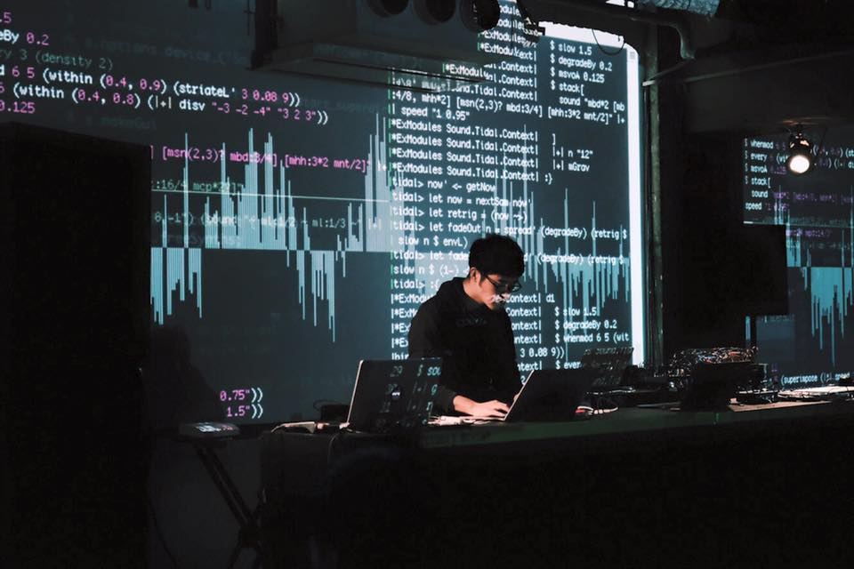

Photo by Yasushi Fukuzawa

### Koichiro Mori

Koichiro MORI (b.1983) Being interested in the notions of “Inter-textuality” and “Subjectivity”, he researches the structures visible in paintings and other visual media by perception and calculation through “Painter Emulator”, the original machine to generate abstract paintings automatically. Additionally to his solo activities, many collaborative projects with various artists.

- web site: [https://moxus.org][1]

- [github][2]

- [twitter][3] 

- [vimeo][4]

- [soundcloud][5]

- [tumblr][6]

- [YouTube][7]
 

### Education

-  2009 Post-graduate program of [Information Design Dept. at Tama Art University][8]

### Exhibitions

- Feb. 2013 : [Yebisu International Festival for Art & Alternative Visions][9]@[Tokyo Metropolitan Museum of Photography][10] (as [gzk][15])

- Feb. 2012 : mis-conversion@[akibatamabi21][11] in [3331 Arts Chiyoda Tokyo][12]

- Sep. 2010 : Incheon Internationoal Digital Art Festival 2010@Tomorrow City Incheon

- Jun. 2010 : [log / score – instrumentation of ice][13]@[MONKEY GALLERY Tokyo][14] (as [gzk][15])

- Mar. 2010 : papuning Plug and Plays@[Tastuno Museum Nagano][16]

- Aug. 2009 : Swaying Life / Crossroads of Arts@Koriyama City Museum of Art Fukushima (as [gzk][15])

- May. 2009-10 : [OPEN SPACE 2009][17]@[NTT InterCommunication Center [ICC] Tokyo][18] (as M.K.I.)

- Sep. 2008 : [ArtBots][19]@[Science Gallery Dublin Ireland][20]

- Jul. 2008 : EIZONE 2008@[Yokohama Red Brick Warehouse][21]

- Jun. 2008 : Media Art Festival in ECC@[Ewha Womens Unversity Seoul][22]

- Jun. 2007 : [Insight Vision II][23]＠[Tama Art University Tokyo][24]

- Mar. 2007 : [NO MAP][25]＠[BankArt 1929 Yokohama][26]

[1]: https://moxus.org
[2]: https://github.com/moxuse/
[3]: https://twitter.com/moxus/
[4]: https://vimeo.com/moxus/
[5]: https://soundcloud.com/moxus
[6]: https://moxus.tumblr.com/
[7]: https://youtube.com/profile?user=moxuse
[8]: http://www.idd.tamabi.ac.jp

[9]: http://www.yebizo.com/
[10]: http://www.syabi.com/
[11]: http://akibatamabi21.com/
[12]: http://www.3331.jp/
[13]: http://ice.gzk.jp/ex/
[14]: http://monkeycafe.jp
[15]: http://gzk.jp/
[16]: http://artm.town.tatsuno.nagano.jp
[17]: http://www.ntticc.or.jp/Exhibition/2009/Openspace2009/index.html
[18]: http://www.ntticc.or.jp/
[19]: https://en.wikipedia.org/wiki/ArtBots
[20]: http://www.sciencegallery.ie/
[21]: http://www.yokohama-akarenga.jp/index.html
[22]: http://www.ewha.ac.kr/
[23]: http://www.idd.tamabi.ac.jp/art/event07/insightvision2/index.htm
[24]: http://tamabi.ac.jp/
[25]: http://www.idd.tamabi.ac.jp/art/exhibit/gw06/
[26]: http://www.bankart1929.com

#### Contact

Mail : info@moxus.org
